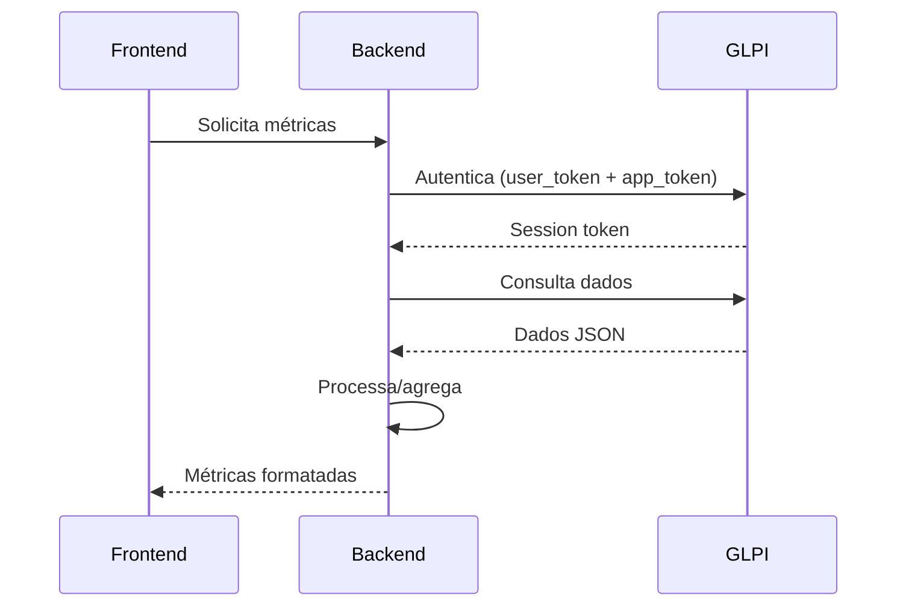
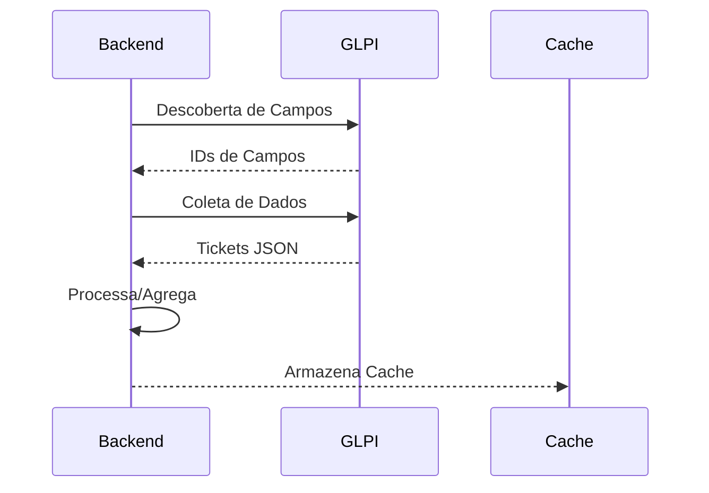
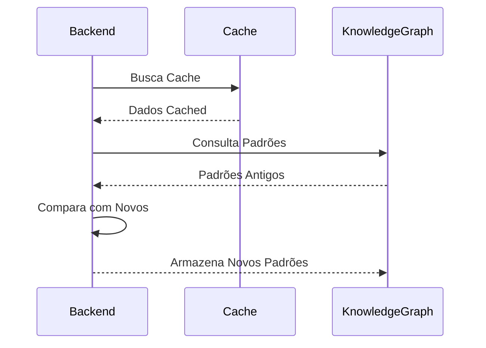
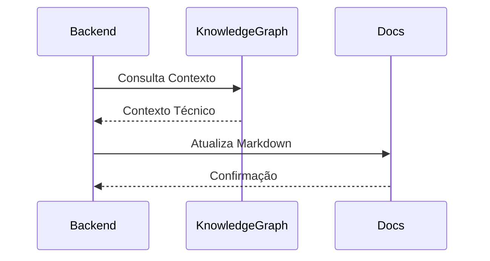

# Arquitetura do GLPI Dashboard

> **Documentação Viva** - Atualizada automaticamente em: 2025-08-14 20:51:00

## Visão Geral da Arquitetura

### Stack Tecnológico

- **Backend**: FastAPI + Python 3.11+
- **Frontend**: React + TypeScript + Vite
- **Integração**: GLPI REST API
- **Observabilidade**: Logs estruturados + Métricas
- **Validação**: Sistema automático de testes
- **Conhecimento**: MCP Knowledge Graph persistente

### Estrutura de Diretórios

```bash
glpi_dashboard/
 backend/           # API FastAPI
    app/          # Aplicação principal
    domain/       # Entidades de domínio
    adapters/     # Adaptadores externos
    tests/        # Testes automatizados
 frontend/         # Interface React
    src/          # Código fonte
    components/   # Componentes reutilizáveis
 docs/             # Documentação técnica
 scripts/          # Scripts de automação
 artifacts/        # Resultados de validação
```

## Fluxo de Dados Críticos

### 1. Autenticação GLPI



### 2. Pipeline de Métricas



### 3. Pipeline de Validação



### 4. Pipeline de Documentação



1. **Descoberta de Campos**: Identifica IDs dinâmicos dos campos GLPI
2. **Coleta de Dados**: Busca tickets com filtros específicos
3. **Agregação**: Processa por nível (N1-N4) e status
4. **Validação**: Verifica integridade dos dados
5. **Entrega**: Formata para consumo do frontend

## Pontos Críticos de Falha

### Problema: Dados Zerados

**Sintomas**: Cards do dashboard exibem 0 quando deveriam ter valores

**Causas Identificadas**:

1. **Autenticação**: Tokens inválidos ou expirados
2. **Descoberta de Campos**: IDs de campos alterados no GLPI
3. **Filtros**: Critérios muito restritivos
4. **Mapeamento**: Inconsistência entre níveis/status

**Soluções Implementadas**:

- Sistema de validação automática (`enhanced_validation.py`)
- Knowledge Graph para rastrear padrões
- Logs estruturados para diagnóstico
- Fallbacks para campos não encontrados

## Guia de Troubleshooting

### Diagnóstico Rápido

```bash
# 1. Verificar serviços
docker-compose ps

# 2. Validar sistema completo
python enhanced_validation.py

# 3. Testar autenticação GLPI
python backend/debug_glpi_auth.py

# 4. Verificar logs estruturados
tail -f backend/logs/app.log | jq .
```

### Checklist de Problemas Comuns

#### Dados Zerados

- [ ] Verificar tokens GLPI válidos
- [ ] Confirmar descoberta de campos
- [ ] Validar filtros de data
- [ ] Testar conectividade GLPI

#### Performance Lenta

- [ ] Verificar cache Redis
- [ ] Analisar queries GLPI
- [ ] Monitorar uso de CPU/memória
- [ ] Otimizar agregações

#### Erros de Autenticação

- [ ] Renovar user_token
- [ ] Verificar app_token
- [ ] Confirmar permissões GLPI
- [ ] Testar conectividade de rede

## Métricas e Monitoramento

### Endpoints de Saúde

- `GET /health` - Status geral do sistema
- `GET /metrics` - Métricas Prometheus
- `GET /api/tickets/summary` - Dados principais

### Alertas Automáticos

- Dados zerados detectados
- Falhas de autenticação
- Timeouts de API
- Inconsistências de dados

## Knowledge Graph

O sistema mantém um grafo de conhecimento persistente com:

- **Entidades**: Componentes, problemas, soluções
- **Relações**: Dependências, causas, efeitos
- **Observações**: Lições aprendidas, padrões

### Consultas Úteis

```python
# Buscar problemas relacionados a dados zerados
run_mcp("mcp.config.usrlocalmcp.Persistent Knowledge Graph", 
        "search_nodes", {"query": "dados zerados"})

# Obter detalhes de um componente
run_mcp("mcp.config.usrlocalmcp.Persistent Knowledge Graph", 
        "open_nodes", {"names": ["GLPI Service"]})
```

## Protocolo de Mudanças

### Antes de Qualquer Alteração

1. **Backup**: Snapshot do estado atual
2. **Validação**: Execute `enhanced_validation.py`
3. **Documentação**: Atualize este arquivo
4. **Testes**: Rode suite completa

### Após Implementação

1. **Validação**: Confirme dados não zerados
2. **Monitoramento**: Observe métricas por 24h
3. **Knowledge Graph**: Registre lições aprendidas
4. **Rollback**: Tenha plano de reversão pronto

## Status Atual do Sistema

**Última Atualização**: 2025-08-14 20:51:00
**Commit**: 2b3706e
**Validação**: error_reading_validation

### Estatísticas

- **Knowledge Graph**: 11 entidades, 22 relações
- **Testes Backend**: 6 arquivos de teste
- **Testes Frontend**: 17 arquivos de teste
- **Última Validação**: N/A

### Dependências Ativas

- **backend**: pyproject.toml found
- **frontend**: React ^18.2.0

## Referências Técnicas

- [GLPI REST API Documentation](https://github.com/glpi-project/glpi/blob/master/apirest.md)
- [FastAPI Best Practices](https://fastapi.tiangolo.com/)
- [React Performance Optimization](https://react.dev/learn/render-and-commit)

---

**Última Atualização**: 2025-08-14 20:51:00
**Responsável**: Sistema de Documentação Viva
**Versão**: 1.0.0
