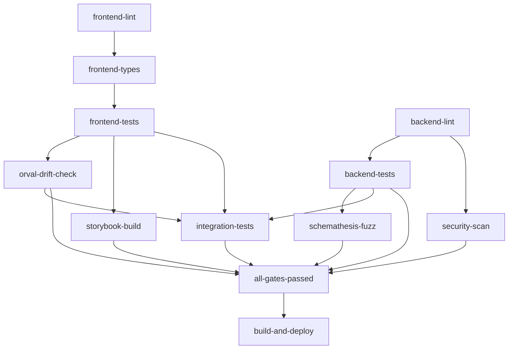

# CI/CD Pipeline - Robust Gates

Este documento descreve o pipeline de CI/CD robusto implementado para o projeto GLPI Dashboard, que inclui múltiplos gates de qualidade para garantir a integridade do código.

##  Gates Implementados

### Frontend Gates
1. **Lint & Format** - ESLint e Prettier
2. **Type Check** - TypeScript type checking
3. **Unit Tests** - Vitest com cobertura
4. **Orval Drift Check** - Verificação de sincronização da API
5. **Storybook Build** - Build dos componentes visuais

### Backend Gates
1. **Lint & Format** - flake8, black, isort
2. **Type Check** - mypy
3. **Unit Tests** - pytest com cobertura
4. **Security Scan** - bandit e safety

### Integration Gates
1. **Schemathesis** - API fuzzing e testes de propriedades
2. **Integration Tests** - Testes end-to-end

##  Secrets Necessários

Para configurar o pipeline no GitHub Actions, você precisa definir os seguintes secrets no repositório:

### Obrigatórios
- `GITHUB_TOKEN` - Token automático do GitHub (já disponível)

### Opcionais (com fallbacks)
- `GLPI_API_URL` - URL da API GLPI (fallback: `http://localhost:8080`)
- `GLPI_APP_TOKEN` - Token da aplicação GLPI (fallback: `test_app_token`)
- `GLPI_USER_TOKEN` - Token do usuário GLPI (fallback: `test_user_token`)
- `SONAR_TOKEN` - Token do SonarCloud (opcional para análise de qualidade)
- `CHROMATIC_PROJECT_TOKEN` - Token do Chromatic (opcional para testes visuais)
- `SENTRY_DSN` - DSN do Sentry (opcional para monitoramento)

### Como Configurar os Secrets

1. Acesse o repositório no GitHub
2. Vá em **Settings** > **Secrets and variables** > **Actions**
3. Clique em **New repository secret**
4. Adicione cada secret necessário

##  Estrutura do Pipeline

### Ordem de Execução



### Gates Críticos

Os seguintes gates **DEVEM** passar para que o pipeline seja considerado bem-sucedido:

1. **Orval Drift Check** - Falha se a API não estiver sincronizada
2. **Unit Tests** - Falha se algum teste unitário quebrar
3. **Storybook Build** - Falha se o Storybook não conseguir buildar
4. **Type Check** - Falha se houver erros de tipagem
5. **Lint** - Falha se houver problemas de linting

##  Comandos Locais

Antes de fazer push, execute localmente:

### Frontend
```bash
cd frontend
npm run lint
npm run format:check
npm run type-check
npm test
npm run gen:api
npm run build-storybook
```

### Backend
```bash
cd backend
flake8 . --count --max-complexity=10 --max-line-length=127
isort --check-only --diff .
black --check --diff .
mypy . --ignore-missing-imports
pytest --cov=. --cov-report=term-missing
```

##  Troubleshooting

### Orval Drift Detectado
```bash
cd frontend
npm run gen:api
git add src/api/
git commit -m "fix: sync API types with orval"
```

### Testes Falhando
```bash
# Frontend
cd frontend
npm test

# Backend
cd backend
pytest -v
```

### Storybook Não Builda
```bash
cd frontend
npm run storybook
# Verifique os erros no console
npm run build-storybook
```

### Problemas de Lint
```bash
# Frontend
cd frontend
npm run lint:fix
npm run format

# Backend
cd backend
black .
isort .
```

##  Cobertura e Relatórios

- **Frontend Coverage**: Enviado para Codecov com flag `frontend`
- **Backend Coverage**: Enviado para Codecov com flag `backend`
- **Security Reports**: Bandit JSON report como artifact
- **Storybook Build**: Artifact disponível por 7 dias

##  Critérios de Sucesso

 **Pipeline Passando Localmente**: Todos os comandos acima devem executar sem erro

 **PR com Checks Acionados**: O pipeline deve rodar automaticamente em PRs

 **Gates Falhando Corretamente**: 
- Orval drift deve falhar se API não sincronizada
- Testes devem falhar se quebrados
- Storybook deve falhar se não buildar

##  Workflow de Desenvolvimento

1. **Desenvolvimento Local**: Execute os comandos locais antes do commit
2. **Commit**: Use conventional commits
3. **Push**: O pipeline roda automaticamente
4. **PR**: Todos os gates devem passar
5. **Merge**: Deploy automático apenas na branch `main`

##  Notas Importantes

- O deploy só acontece na branch `main` após todos os gates passarem
- Schemathesis roda com `continue-on-error: true` para não bloquear o pipeline
- Security scan é executado em paralelo para otimizar tempo
- Artifacts são mantidos por períodos específicos para economizar espaço

---

**Última atualização**: Pipeline implementado com gates robustos para lint, types, unit, orval drift, schemathesis e storybook.
