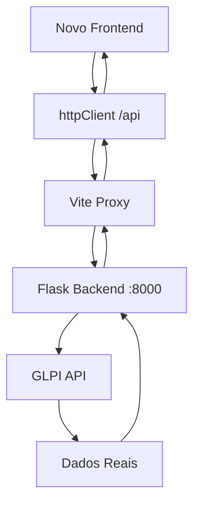

# 📋 Documentação Técnica: Substituição Completa do Frontend

## 🎯 **Objetivo**
Este documento mapeia todos os aspectos técnicos necessários para substituir completamente o frontend atual (React) por uma nova interface baseada em design do Figma, mantendo os dados reais do GLPI funcionando perfeitamente.

---

## 🏗️ **1. ARQUITETURA DE DADOS E APIs**

### **1.1 Endpoints da API Backend**
O sistema backend expõe os seguintes endpoints principais:

```typescript
// BASE_URL: /api (proxy para localhost:8000)
const ENDPOINTS = {
  METRICS: '/api/metrics',                    // Métricas principais do dashboard
  METRICS_FILTERED: '/api/metrics/filtered',  // Métricas com filtros aplicados  
  HEALTH: '/api/health',                      // Status do sistema
  TECHNICIAN_RANKING: '/api/technicians/ranking', // Ranking de técnicos
  NEW_TICKETS: '/api/tickets/new',            // Tickets recentes
  SYSTEM_STATUS: '/api/status',               // Status detalhado do sistema
  DATA_INTEGRITY: '/api/data-integrity',     // Relatório de integridade
  CACHE_STATS: '/api/cache/stats',           // Estatísticas do cache
  PERFORMANCE: '/api/performance'             // Métricas de performance
}

// Parâmetros aceitos por endpoint
const ENDPOINT_PARAMS = {
  '/api/metrics': ['start_date', 'end_date', 'level', 'status'],
  '/api/technicians/ranking': ['start_date', 'end_date', 'level'],
  '/api/tickets/new': ['limit', 'offset', 'level'],
  '/api/metrics/filtered': ['period', 'levels[]', 'status[]', 'priority[]']
}
```

### **1.2 Estrutura de Dados das Métricas**

```typescript
// Estrutura principal de dados que alimenta o dashboard
interface DashboardMetrics {
  niveis: {
    n1: LevelMetrics;    // Suporte Básico (Group ID 89)
    n2: LevelMetrics;    // Suporte Intermediário (Group ID 90)
    n3: LevelMetrics;    // Suporte Avançado (Group ID 91)
    n4: LevelMetrics;    // Suporte Especialista (Group ID 92)
    geral: LevelMetrics; // Totais gerais
  };
  tendencias: {
    novos: string;       // Ex: "+7%"
    pendentes: string;   // Ex: "-7%"
    progresso: string;   // Ex: "+25%"
    resolvidos: string;  // Ex: "+31%"
  };
  timestamp: string;     // Timestamp da última atualização
  systemStatus: SystemStatus; // Status do GLPI e API
}

// Métricas por nível de suporte
interface LevelMetrics {
  novos: number;         // Tickets novos
  pendentes: number;     // Tickets pendentes
  progresso: number;     // Tickets em progresso
  resolvidos: number;    // Tickets resolvidos
  total: number;         // Total de tickets
}
```

### **1.3 Sistema de Filtros**

```typescript
interface FilterParams {
  period?: 'today' | 'week' | 'month';
  levels?: string[];     // ['N1', 'N2', 'N3', 'N4']
  status?: string[];     // ['new', 'progress', 'pending', 'resolved']
  priority?: string[];   // ['high', 'medium', 'low']
  dateRange?: {
    startDate: string;   // Formato: YYYY-MM-DD
    endDate: string;     // Formato: YYYY-MM-DD
    label?: string;
  };
  technician?: string;
  category?: string;
  filterType?: string;   // 'creation', 'modification', 'current_status'
}
```

---

## 🔌 **2. INTEGRAÇÃO COM API (HTTP CLIENT)**

### **2.1 Configuração do Cliente HTTP**

```typescript
// Configuração essencial para conectar com o backend
export const API_CONFIG = {
  BASE_URL: '/api',                    // Usar proxy do Vite
  TIMEOUT: 30000,                      // 30 segundos
  RETRY_ATTEMPTS: 3,                   // 3 tentativas
  RETRY_DELAY: 1000,                   // 1 segundo entre tentativas
};

// Headers obrigatórios
const defaultHeaders = {
  'Content-Type': 'application/json',
  'Accept': 'application/json',
};
```

### **2.2 Autenticação GLPI**

```typescript
// Tokens necessários para GLPI (gerenciados via variáveis de ambiente)
interface AuthConfig {
  apiToken?: string;     // VITE_API_TOKEN
  appToken?: string;     // VITE_APP_TOKEN  
  userToken?: string;    // VITE_USER_TOKEN
}

// Headers de autenticação para GLPI
const authHeaders = {
  'Authorization': `Bearer ${apiToken}`,
  'App-Token': appToken,
  'Session-Token': userToken,
};
```

### **2.3 Interceptadores de Requisição**

```typescript
// Interceptador para autenticação automática
httpClient.interceptors.request.use((config) => {
  // Adicionar tokens de autenticação
  if (authConfig.apiToken) {
    config.headers['Authorization'] = `Bearer ${authConfig.apiToken}`;
  }
  return config;
});

// Interceptador para tratamento de erro
httpClient.interceptors.response.use(
  (response) => response,
  (error) => {
    // Retry automático em caso de erro de rede
    // Refresh automático de tokens
    // Log de erros estruturado
  }
);
```

---

## 🎨 **3. COMPONENTES E INTERFACE**

### **3.1 Componentes Principais**

```typescript
// Componentes que exibem dados reais do GLPI
const MAIN_COMPONENTS = {
  // 📊 Métricas Principais
  MetricsGrid: {
    purpose: "Exibe métricas por nível (N1-N4)",
    data: "DashboardMetrics.niveis",
    location: "frontend/src/components/dashboard/MetricsGrid.tsx"
  },
  
  // 📈 Cards de Status
  StatusCard: {
    purpose: "Card individual para cada métrica",
    data: "LevelMetrics + tendências",
    location: "frontend/src/components/dashboard/StatusCard.tsx"
  },
  
  // 🏆 Ranking de Técnicos
  RankingTable: {
    purpose: "Tabela de performance dos técnicos",
    data: "TechnicianRanking[]",
    location: "frontend/src/components/dashboard/RankingTable.tsx"
  },
  
  // 🎫 Tickets Recentes
  NewTicketsList: {
    purpose: "Lista de tickets novos",
    data: "NewTicket[]",
    location: "frontend/src/components/dashboard/NewTicketsList.tsx"
  },
  
  // ⚡ Status do Sistema
  SystemStatusCard: {
    purpose: "Status do GLPI e API",
    data: "SystemStatus",
    location: "frontend/src/components/dashboard/SystemStatusCard.tsx"
  }
};
```

### **3.2 Props e Interfaces dos Componentes**

```typescript
// Props típicos dos componentes principais
interface MetricsGridProps {
  metrics: DashboardMetrics;
  loading?: boolean;
  error?: string | null;
  onRefresh?: () => void;
  filters?: FilterParams;
}

interface StatusCardProps {
  title: string;           // Ex: "Tickets N1"
  value: number;           // Ex: 214
  status?: string;         // Ex: "active", "pending"
  trend?: {
    direction: 'up' | 'down' | 'stable';
    value: number;         // Ex: 7 (para +7%)
    label?: string;
  };
  icon?: LucideIcon;
  variant?: 'default' | 'compact' | 'detailed' | 'gradient';
  onClick?: () => void;
}
```

### **3.3 Sistema de Temas e Styling**

```typescript
// Configuração de temas (TailwindCSS + CSS Variables)
export const THEMES = {
  light: {
    colors: {
      primary: '#3B82F6',      // Azul principal
      secondary: '#6B7280',    // Cinza secundário
      success: '#10B981',      // Verde para resolvidos
      warning: '#F59E0B',      // Amarelo para pendentes
      error: '#EF4444',        // Vermelho para atrasados
      background: '#FFFFFF',   // Fundo branco
      surface: '#F9FAFB',      // Superfície dos cards
      text: '#111827',         // Texto principal
    }
  },
  dark: {
    colors: {
      primary: '#60A5FA',
      secondary: '#9CA3AF', 
      success: '#34D399',
      warning: '#FBBF24',
      error: '#F87171',
      background: '#111827',
      surface: '#1F2937',
      text: '#F9FAFB',
    }
  }
};
```

---

## 🔄 **4. SISTEMA DE CACHE E PERFORMANCE**

### **4.1 Cache de Dados**

```typescript
// Sistema de cache inteligente para otimização
interface CacheConfig {
  enabled: boolean;        // Cache ativo
  ttl: number;            // 300000ms (5 minutos)
  maxSize: number;        // 100 entradas máximo
  strategy: 'lru';        // Estratégia LRU
  autoActivate: boolean;  // Ativação automática baseada em padrões
}

// Chaves de cache utilizadas
const CACHE_KEYS = {
  metrics: 'metrics-{dateRange}',
  ranking: 'technician-ranking-{filters}',
  newTickets: 'new-tickets-{limit}',
  systemStatus: 'system-status'
};
```

### **4.2 Smart Refresh System**

```typescript
// Sistema de refresh inteligente
const REFRESH_CONFIG = {
  DEFAULT_INTERVAL: 30000,     // 30 segundos
  MIN_INTERVAL: 5000,          // 5 segundos mínimo
  MAX_INTERVAL: 300000,        // 5 minutos máximo
  ADAPTIVE_REFRESH: true,      // Adapta baseado na atividade
  PAUSE_ON_HIDDEN: true,       // Pausa quando aba não visível
};
```

---

## 📱 **5. HOOKS E ESTADO**

### **5.1 Hooks Personalizados**

```typescript
// Hook principal para métricas
const useMetrics = (options?: {
  autoExecute?: boolean;
  dependencies?: any[];
  dateRange?: DateRange;
}) => {
  return {
    data: DashboardMetrics | null;
    loading: boolean;
    error: string | null;
    execute: (...args: any[]) => Promise<void>;
    reset: () => void;
  };
};

// Hook para status do sistema
const useSystemStatus = () => {
  return {
    data: SystemStatus | null;
    loading: boolean;
    error: string | null;
    isOnline: boolean;
    lastUpdate: Date | null;
  };
};

// Hook para ranking de técnicos
const useTechnicianRanking = (filters?: FilterParams) => {
  return {
    data: TechnicianRanking[] | null;
    loading: boolean;
    error: string | null;
    execute: (filters?: FilterParams) => Promise<void>;
  };
};
```

### **5.2 Gerenciamento de Estado**

```typescript
// Estado global da aplicação
interface DashboardState {
  metrics: DashboardMetrics | null;
  systemStatus: SystemStatus | null;
  technicianRanking: TechnicianRanking[];
  newTickets: NewTicket[];
  isLoading: boolean;
  error: string | null;
  lastUpdated: Date | null;
  filters: FilterParams;
  theme: 'light' | 'dark';
  notifications: Notification[];
}
```

---

## ⚙️ **6. CONFIGURAÇÃO E AMBIENTE**

### **6.1 Variáveis de Ambiente**

```bash
# Configuração essencial para funcionamento
VITE_API_BASE_URL=/api                    # Base da API (proxy)
VITE_API_TIMEOUT=30000                    # Timeout das requisições
VITE_LOG_LEVEL=info                       # Nível de log
VITE_SHOW_API_CALLS=false                 # Debug das chamadas API
VITE_SHOW_PERFORMANCE=false               # Métricas de performance

# Autenticação GLPI (opcional - gerenciado pelo backend)
VITE_API_TOKEN=                           # Token da API GLPI
VITE_APP_TOKEN=                           # App Token GLPI
VITE_USER_TOKEN=                          # User Token GLPI
```

### **6.2 Configuração do Vite**

```typescript
// vite.config.ts - Configuração essencial
export default defineConfig({
  server: {
    host: '0.0.0.0',
    port: 5000,
    proxy: {
      '/api': {
        target: 'http://localhost:8000',  // Backend Flask
        changeOrigin: true,
        secure: false,
      },
    },
  },
  build: {
    outDir: 'dist',
    sourcemap: true,
  },
});
```

---

## 🔗 **7. INTEGRAÇÃO BACKEND-FRONTEND**

### **7.1 Fluxo de Dados**



### **7.2 Formatação de Resposta**

```typescript
// Formato padrão das respostas da API
interface ApiResponse<T> {
  success: true;
  data: T;                    // Dados solicitados
  message?: string;           // Mensagem opcional
  timestamp?: string;         // Timestamp da resposta
  performance?: {
    responseTime: number;     // Tempo de resposta em ms
    cacheHit: boolean;        // Se veio do cache
    endpoint: string;         // Endpoint chamado
  };
}

interface ApiError {
  success: false;
  error: string;              // Mensagem de erro
  details?: any;              // Detalhes do erro
  timestamp?: string;
  code?: string | number;     // Código do erro
}
```

---

## 📊 **8. MAPEAMENTO DE CAMPOS DE DADOS**

### **8.1 Campos Principais no Dashboard**

| **Campo UI** | **Origem dos Dados** | **Tipo** | **Endpoint** |
|--------------|---------------------|----------|---------------|
| Total Tickets N1 | `data.niveis.n1.total` | number | `/api/metrics` |
| Novos N1 | `data.niveis.n1.novos` | number | `/api/metrics` |
| Em Progresso N1 | `data.niveis.n1.progresso` | number | `/api/metrics` |
| Pendentes N1 | `data.niveis.n1.pendentes` | number | `/api/metrics` |
| Resolvidos N1 | `data.niveis.n1.resolvidos` | number | `/api/metrics` |
| Tendência Novos | `data.tendencias.novos` | string | `/api/metrics` |
| Status GLPI | `data.systemStatus.glpi` | string | `/api/status` |
| Tempo Resposta | `data.systemStatus.glpi_response_time` | number | `/api/status` |
| Ranking Técnico | `data[].name, total, rank` | array | `/api/technicians/ranking` |
| Tickets Recentes | `data[].title, date, priority` | array | `/api/tickets/new` |

### **8.2 Mapeamento de Status**

```typescript
// Mapeamento de status do GLPI para UI
const STATUS_MAPPING = {
  'Novo': 'novos',
  'Processando (atribuído)': 'progresso',
  'Processando (planejado)': 'progresso', 
  'Pendente': 'pendentes',
  'Solucionado': 'resolvidos',
  'Fechado': 'resolvidos'
};

// Cores por status
const STATUS_COLORS = {
  novos: '#3B82F6',        // Azul
  progresso: '#F59E0B',    // Amarelo
  pendentes: '#EF4444',    // Vermelho
  resolvidos: '#10B981'    // Verde
};
```

---

## 🛠️ **9. FERRAMENTAS E DEPENDÊNCIAS**

### **9.1 Dependências Essenciais**

```json
{
  "dependencies": {
    "axios": "^1.6.0",              // Cliente HTTP
    "react": "^18.2.0",             // Framework React
    "react-query": "^4.0.0",        // Cache e estado server
    "framer-motion": "^10.0.0",     // Animações
    "lucide-react": "^0.300.0",     // Ícones
    "class-variance-authority": "^0.7.0", // Variantes CSS
    "tailwindcss": "^3.3.0"         // Styling
  }
}
```

### **9.2 Estrutura de Arquivos**

```
novo-frontend/
├── src/
│   ├── components/          # Componentes reutilizáveis
│   │   ├── ui/             # Componentes base (Button, Card, etc)
│   │   └── dashboard/      # Componentes específicos do dashboard
│   ├── hooks/              # Hooks personalizados
│   ├── services/           # Serviços de API
│   ├── types/              # Tipos TypeScript
│   ├── config/             # Configurações
│   └── utils/              # Utilitários
├── public/                 # Arquivos estáticos
└── dist/                   # Build de produção
```

---

## 🔧 **10. IMPLEMENTAÇÃO PASSO A PASSO**

### **10.1 Fase 1: Setup Básico**
1. **Configurar novo projeto** com Vite + React + TypeScript
2. **Configurar proxy** para `/api` → `localhost:8000`
3. **Implementar httpClient** com interceptadores
4. **Configurar tipos TypeScript** baseados na API atual

### **10.2 Fase 2: Componentes Core**
1. **Implementar hooks de dados** (`useMetrics`, `useSystemStatus`)
2. **Criar componentes UI base** (Button, Card, Input)
3. **Desenvolver componentes específicos** (MetricsGrid, StatusCard)
4. **Configurar sistema de temas**

### **10.3 Fase 3: Integração de Dados**
1. **Conectar componentes com hooks**
2. **Implementar sistema de cache**
3. **Configurar refresh automático**
4. **Adicionar tratamento de erros**

### **10.4 Fase 4: Validação**
1. **Testar com dados reais do GLPI**
2. **Validar performance e cache**
3. **Verificar responsividade**
4. **Testar estados de erro**

---

## ✅ **11. CHECKLIST DE VALIDAÇÃO**

### **11.1 Conectividade**
- [ ] Proxy `/api` funcionando
- [ ] Requisições chegando ao backend Flask
- [ ] Respostas sendo recebidas no frontend
- [ ] Autenticação GLPI operacional

### **11.2 Dados**
- [ ] Métricas N1-N4 sendo exibidas corretamente
- [ ] Tendências calculadas e formatadas
- [ ] Status do sistema atualizado
- [ ] Ranking de técnicos carregado
- [ ] Tickets recentes listados

### **11.3 Performance**
- [ ] Cache funcionando (hit rate > 80%)
- [ ] Refresh automático operacional
- [ ] Tempo de resposta < 2s
- [ ] Sem vazamentos de memória

### **11.4 Interface**
- [ ] Responsividade em diferentes tamanhos
- [ ] Temas claro/escuro funcionando
- [ ] Animações suaves
- [ ] Estados de loading/erro

---

## 🚀 **12. MIGRAÇÃO E SUBSTITUIÇÃO**

### **12.1 Estratégia de Migração**
1. **Desenvolvimento paralelo** do novo frontend
2. **Testes com dados reais** em ambiente de desenvolvimento
3. **Validação completa** com stakeholders
4. **Substituição gradual** ou completa

### **12.2 Rollback Plan**
- **Backup completo** do frontend atual
- **Configuração de proxy** facilmente reversível
- **Deploy independente** do novo frontend
- **Monitoramento ativo** pós-migração

---

## 📞 **13. PONTOS DE ATENÇÃO**

### **13.1 Críticos**
- ⚠️ **Proxy Vite** deve estar configurado corretamente
- ⚠️ **Base URL** deve ser `/api` (não absoluta)
- ⚠️ **Headers de CORS** configurados no backend
- ⚠️ **Autenticação GLPI** mantida funcional

### **13.2 Performance**
- 📈 **Cache inteligente** ativado automaticamente
- 📈 **Debounce** em filtros e buscas
- 📈 **Lazy loading** de componentes pesados
- 📈 **Request coordination** para evitar duplicatas

### **13.3 Experiência do Usuário**
- 🎨 **Estados de loading** bem definidos
- 🎨 **Mensagens de erro** claras e úteis
- 🎨 **Feedback visual** para todas as ações
- 🎨 **Responsividade** em todos os dispositivos

---

Este documento fornece o **conhecimento completo e necessário** para substituir o frontend atual mantendo todos os dados reais do GLPI funcionando perfeitamente. Cada seção mapeia aspectos específicos que devem ser replicados na nova interface baseada no design do Figma.