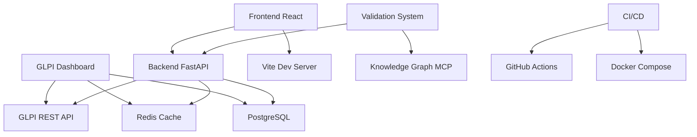

# Mapa de Dependências

> Gerado automaticamente em: 2025-08-14 20:51:00

## Dependências Externas

## Dependências Internas

### Backend

- FastAPI (API framework)
- Pydantic (validação de dados)
- SQLAlchemy (ORM)
- Redis (cache)
- Pytest (testes)

### Frontend

- React (UI framework)
- TypeScript (tipagem)
- Vite (build tool)
- Tailwind CSS (styling)
- Vitest (testes)

### DevOps

- Docker & Docker Compose
- GitHub Actions
- Pre-commit hooks
- Ruff (linting)

## Pontos de Falha Críticos

1. **GLPI API**: Fonte única de dados
2. **Autenticação**: Tokens podem expirar
3. **Descoberta de Campos**: IDs dinâmicos
4. **Cache Redis**: Performance dependente

---

**Atualização**: Automática via `python scripts/update_docs.py`
